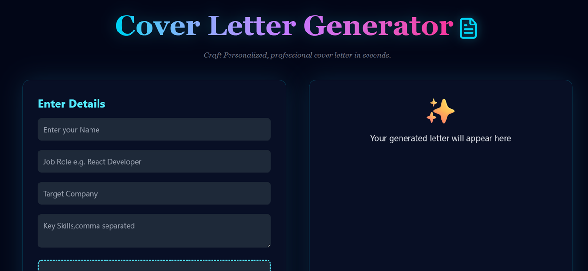
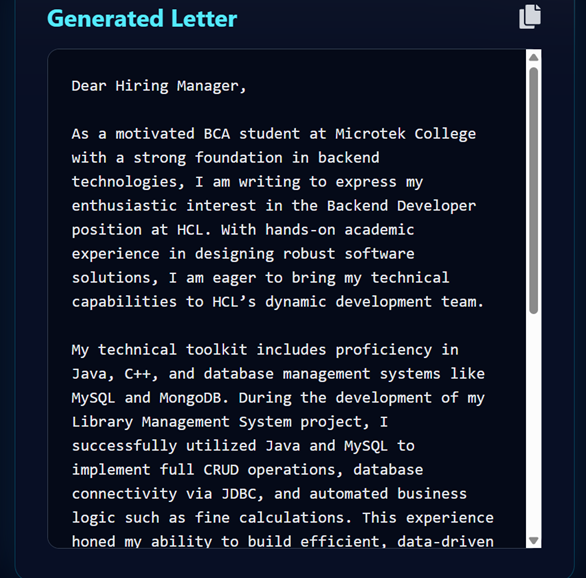

## 🤖 AI Cover Letter Generator 

An AI-powered web application that helps users generate professional and pesonalized cover letters on their job details, skills, experience, and other relevant information.

✨ Features

- 📝 Generate professional cover letters using AI.
- 🎯 Create personalized cover letters based on given information.
- ⚡ Fast and easy-to-use interface.
- 📱 Responsive design for desktop and mobile.
- 🎨 Modern UI built with React and Tailwind CSS.
- 🔏 Secure backend API using Node and Express.
- 📋 Easy copy of generated cover letters.

⚒️ Tech Stack

# Frontend

- React.js
- Tailwind CSS
- JavaScript

# Backend

- Node.js
- Express.js

## AI 

AI API for generating personalized cover letters.

📁 Project Structure

AI-Cover-Letter-Generator/
|
|--- client/
|   |-- src/
|   |-- public/
|   |-- package.json
|   |-- ...
|       
|
|--- server/
|    |-- package.json
|    |-- server.js
|    |-- ...
|
|--- Prompt.md
|--- .gitignore

🚀 Getting started

1. Clone repo

git clone https://github.com/rmaurya8545-glitch

2. Install frontend

cd client
npm install

3. Install backend

cd server
npm install

🗝️ Environment Variables

Create .env in server :

PORT=5000
API_KEY= Your_api_key_here

▶️ Run Project

Backend

cd server
node server.js

Frontend

cd client
npm run dev

💡 How It Works
1. User Enter Job details
2. Frontend sends request
3. Backend calls AI API 
4. AI generate cover letter
5. Output displayed

📸 Screenshots

